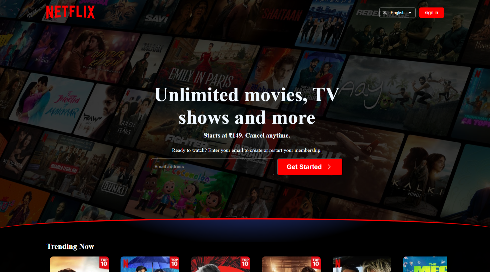
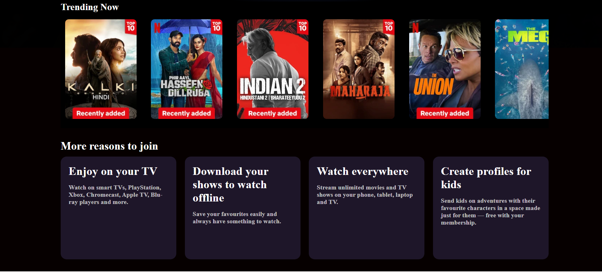
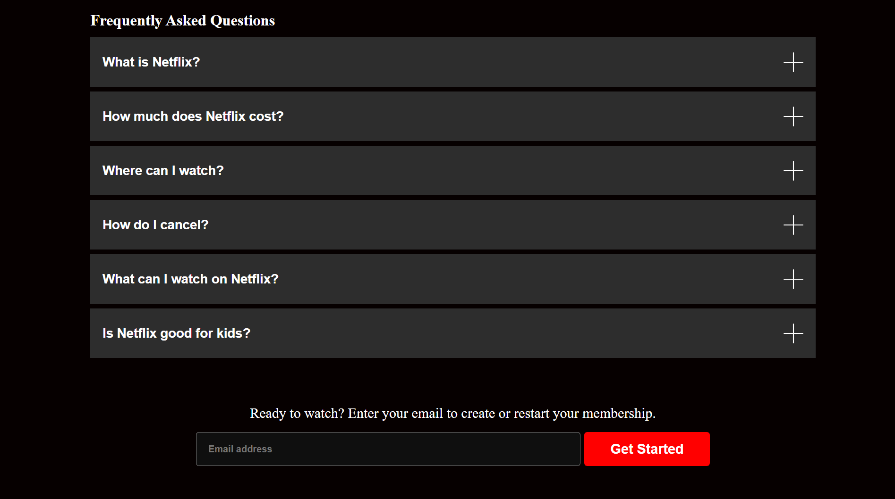
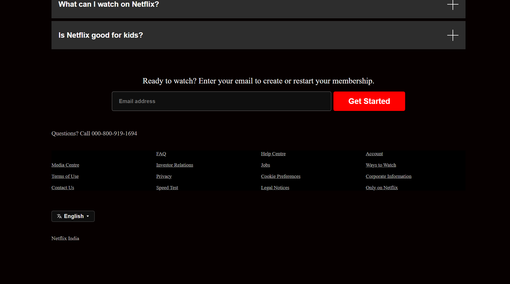

# sasta-natuflix-by-sneh

Sasta Natuflix:-
Sasta Natuflix is a beginner-friendly Netflix clone built using HTML and CSS. This project replicates the core design and responsiveness of Netflix, focusing on layout, styling, and responsive design techniques. The name adds a fun twist, making it a unique and creative learning experience.

Features:-
Netflix-Inspired Design: A simplified version of Netflix’s homepage with a navigation bar, movie thumbnails, and footer.
Responsive Layout: Fully responsive design that adapts to desktops, tablets, and mobile devices using CSS media queries.
Hover Effects: Adds interactivity with hover effects on movie thumbnails and buttons for a better user experience.

Technologies Used:-
HTML: For structuring the content of the webpage.
CSS: For styling, hover effects, and responsive design.
Media Queries: To ensure the layout adjusts seamlessly across all screen sizes.

How to Use:-
Clone this repository:
bash
Copy code
git clone https://github.com/sneh-111/sasta-natuflix-by-sneh.git  
Navigate to the project folder:
bash
Copy code
cd sasta-natuflix  
Open the index.html file in your browser to view the project.

markdown
Copy code

  
  
  

Contact
GitHub: sneh-111.
Email: snehkakadiya1089@gmail.com.

Feel free to explore, learn, and share your feedback!

License
This project is licensed under the MIT License, allowing free use and modification with attribution.

